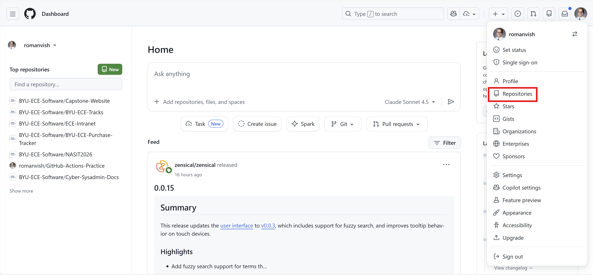
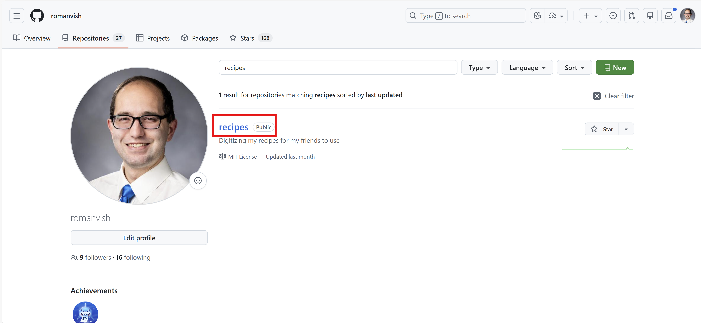
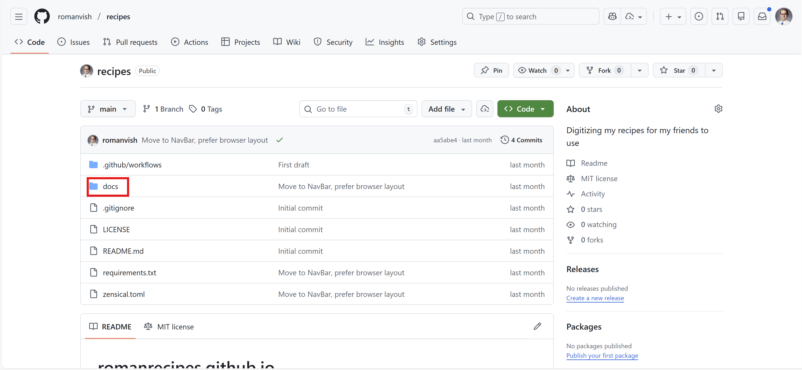
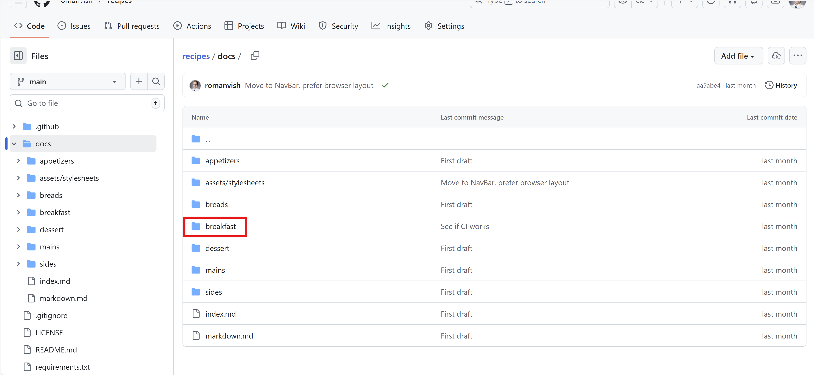
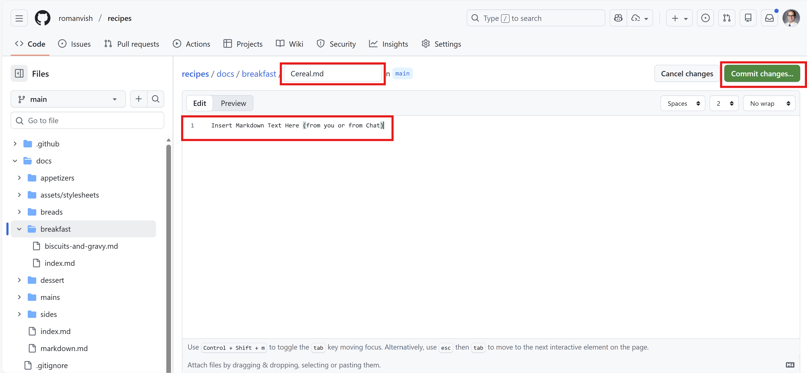

# How to: Add a recipe to the Site

Adding a recipe to this site involves a few steps, but don't worry—I'll guide you through the process. Here's how to do it:
1. **Create a GitHub Account**  
    If you don't already have a GitHub account, you'll need to create one. Follow the instructions in the [How to: Create a GitHub Account](./how-to-create-gh-account.md) guide.
    
2. **Find the Repository on your GitHub Account**  
    Once you have a GitHub account, I'll add you as a collaborator to the repository that hosts this site. You'll receive an invitation via email or notification on GitHub. Accept the invitation to gain access. You'll find it in your repositories list under your GitHub profile. Access your profile repositories by clicking on your icon in the top right corner, then click "repositories"

    

3. **Click on the recipes Repository to get to the list of recipes**  
    Click the repository, you'll see a list of files and folders.

    

4. **Navigate to the docs Folder**  
    Inside the repository, look for a folder named `docs`. Click on it to open the folder where all the files/sections are stored.

    

5. **Create a New File for Your Recipe**  
    Inside the `docs` folder, and optionally if you want to add it into one of the sub-sections, click on the "Add file" button and select "Create new file". Name your file using the format `your-recipe.md`, replacing `your-recipe` with the name of your recipe (e.g `chocolate-cake.md`). Note that there can't be spaces and the file must end in `.md`. After you are done pasting in your changes, click the green "commit changes" button and then it will sync to the website automatically within about 2 minutes.

    
    