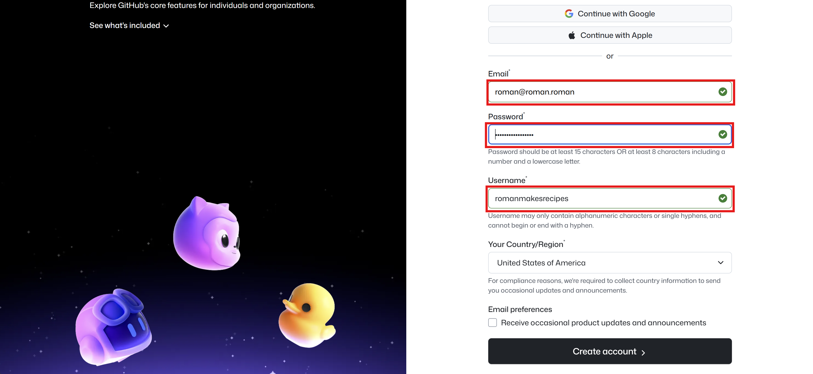

# How to: Create a GitHub Account

Creating a GitHub account is free and easy. Follow the steps below to get started:  
1. **Go to the GitHub Website**  
   Open your web browser and navigate to [https://github.com](https://github.com).   
2. **Sign Up**  
   Click on the "Sign up" button located at the top-right corner of the homepage.   
3. **Enter Your Details**  
   Fill in the required information: 
    - **Username**: Choose a unique username that you will use to log in.  
    - **Email Address**: Provide a valid email address.  
    - **Password**: Create a password for your account.
      
4. **Verify Your Account**  
   Complete the verification process by following the prompts (this may include solving a puzzle or entering a code sent to your email).   
5. **Choose Your Plan**  
   Select the free plan.   
6. **Personalize Your Experience**  
   You may be prompted to answer a few questions about how you plan to use GitHub. This step is optional and can be skipped.   
7. **Complete the Setup**  
   Click on the "Complete setup" button to finalize your account creation.   

As a note, you may have to dodge all the training and "Welcome to GitHub" messages, feel free to learn if you'd like, but also I'll show you how to add recipes without needing to know much about GitHub itself.   

Please text roman your GitHub username once you've created it so I can add you as a collaborator. (We don't want just anyone adding random recipes hehe)

